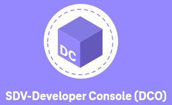

# Eclipse SDV Developer Console

<p align="center">
  
</p>

A comprehensive Software Defined Vehicle (SDV) Developer Console for simulation management, scenario creation, and track management built with Next.js, Spring Boot, and PostgreSQL.

## 📋 Table of Contents

- [Overview](#overview)
- [Architecture](#architecture)
- [Prerequisites](#prerequisites)
- [Quick Start](#quick-start)
- [Detailed Setup](#detailed-setup)
- [Project Structure](#project-structure)
- [Available Scripts](#available-scripts)
- [Accessing Services](#accessing-services)
- [Development Guide](#development-guide)
- [Troubleshooting](#troubleshooting)

---

## 🎯 Overview

The Eclipse SDV Developer Console is a full-stack application that provides:

- 🚗 **Simulation Management** - Create, run, and monitor vehicle simulations
- 📊 **Scenario Library** - Manage test scenarios with CRUD operations
- 🛣️ **Track Management** - Configure and manage simulation tracks
- 📈 **Results Analysis** - Detailed simulation results with metrics and logs
- 🔐 **Secure Authentication** - Keycloak-based authentication system

---

## 🏗️ Architecture

```
┌─────────────────────┐
│  Next.js Frontend   │
│   (Port: 3000)      │
└──────────┬──────────┘
           │
           ↓
┌─────────────────────┐
│   DCO Gateway       │
│   (Port: 8080)      │
└──────────┬──────────┘
           │
     ┌─────┴─────┐
     ↓           ↓
┌─────────┐ ┌─────────┐
│Scenario │ │ Tracks  │
│Service  │ │ Service │
│(8082)   │ │ (8081)  │
└────┬────┘ └────┬────┘
     │           │
     └─────┬─────┘
           ↓
    ┌──────────────┐
    │  PostgreSQL  │
    │  (Port: 5432)│
    └──────────────┘
```

**Key Components:**
- **Frontend**: Next.js 12.3.1 with React, Apollo Client, Material-UI
- **Gateway**: Spring Boot API Gateway with GraphQL
- **Backend Services**: Java Spring Boot microservices
- **Database**: PostgreSQL 12 with initialization scripts
- **Storage**: MinIO for object storage (Port: 9000/9001)

---

## ✅ Prerequisites

Before you begin, ensure you have:

- **Docker Desktop** (v20.10+)
- **Docker Compose** (v2.0+)
- **Git**

**That's it!** Docker handles Java, Node.js, Maven, and all dependencies.

### System Requirements

- **RAM**: Minimum 8GB (16GB recommended)
- **Disk Space**: ~5GB for Docker images
- **OS**: macOS, Linux, or Windows with WSL2

---

## 🚀 Quick Start

### **Option 1: Complete Clean Build (Recommended for First Time)**

\`\`\`bash
# Clone the repository
git clone https://github.com/Liam-24cyber/Eclipse_SDV_Devloper_Console-.git
cd Eclipse_SDV_Devloper_Console-

# Run the complete rebuild (cleans everything and rebuilds from scratch)
./rebuild-all.sh
\`\`\`

This script will:
1. ✅ Clean all previous builds
2. ✅ Build the Next.js frontend
3. ✅ Build all Java backend services
4. ✅ Create optimized Docker images
5. ✅ Verify everything is ready

**Time**: ~5-10 minutes depending on your internet speed

### **Option 2: Quick Build (If Already Set Up)**

\`\`\`bash
# Just build without cleaning
./10-build-script.sh
\`\`\`

### **Option 3: Deploy Everything**

After building, deploy all services:

\`\`\`bash
# Start all services with Docker Compose
./20-deploy-script.sh <minio-access-key> <minio-secret-key>

# Example:
./20-deploy-script.sh minioadmin minioadmin123
\`\`\`

**The application will be ready at: http://localhost:3000**

---

## 📖 Detailed Setup

### Step 1: Clone the Repository

\`\`\`bash
git clone https://github.com/Liam-24cyber/Eclipse_SDV_Devloper_Console-.git
cd Eclipse_SDV_Devloper_Console-
\`\`\`

### Step 2: Build Everything

Choose one of these methods:

#### **Method A: Complete Rebuild (First Time Setup)**

\`\`\`bash
chmod +x rebuild-all.sh
./rebuild-all.sh
\`\`\`

**What it does:**
- Removes all Docker containers, images, and volumes
- Cleans all build artifacts
- Rebuilds Next.js frontend (production build)
- Rebuilds all 3 Java backend services with Maven
- Creates fresh Docker images
- Verifies all images are created successfully

#### **Method B: Quick Build (Already Set Up)**

\`\`\`bash
chmod +x 10-build-script.sh
./10-build-script.sh
\`\`\`

**What it does:**
- Builds Next.js frontend
- Builds Java backend services
- Creates Docker images (uses cache when possible)

### Step 3: Configure MinIO (First Time Only)

MinIO is used for object storage. Configure it once:

1. Create MinIO keys file:
\`\`\`bash
cat > minio/minio_keys.env << EOF
AWS_ACCESS_KEY_ID=minioadmin
AWS_SECRET_ACCESS_KEY=minioadmin123
EOF
\`\`\`

Or use your own keys (more secure):
\`\`\`bash
AWS_ACCESS_KEY_ID=your-custom-access-key
AWS_SECRET_ACCESS_KEY=your-custom-secret-key
\`\`\`

### Step 4: Deploy All Services

\`\`\`bash
chmod +x 20-deploy-script.sh
./20-deploy-script.sh minioadmin minioadmin123
\`\`\`

Replace with your actual MinIO keys if you used custom ones.

**What it does:**
- Starts PostgreSQL database
- Initializes database with schema
- Starts MinIO object storage
- Starts all backend services
- Starts the frontend application

### Step 5: Verify Deployment

Check all services are running:

\`\`\`bash
docker ps
\`\`\`

You should see 6 containers running:
- \`developer-console-ui\`
- \`dco-gateway\`
- \`scenario-library-service\`
- \`tracks-management-service\`
- \`postgres\`
- \`minio\`

---

## 📁 Project Structure

\`\`\`
eclipse-sdv-developer-console/
├── 10-build-script.sh              # Build all services
├── 20-deploy-script.sh             # Deploy with Docker Compose
├── 30-destroy-script.sh            # Stop and remove everything
├── rebuild-all.sh                  # Complete clean rebuild
├── docker-compose.yml              # Docker Compose configuration
├── BUILD_GUIDE.md                  # Detailed build instructions
├── QUICK_START.md                  # Quick reference guide
│
├── developer-console-ui/           # Frontend Application
│   ├── Dockerfile                  # Frontend Docker config
│   ├── package.json                # npm dependencies
│   └── app/                        # Next.js application
│       ├── pages/                  # Next.js pages
│       ├── components/             # React components
│       ├── services/               # API services & mock data
│       └── styles/                 # CSS styles
│
├── dco-gateway/                    # API Gateway Service
│   ├── Dockerfile.app              # Gateway Docker config
│   ├── pom.xml                     # Maven configuration
│   ├── api/                        # API definitions (OpenAPI)
│   └── app/                        # Spring Boot application
│       └── src/
│           ├── main/               # Application code
│           └── test/               # Unit tests
│
├── scenario-library-service/       # Scenario Management Service
│   ├── Dockerfile.app              # Service Docker config
│   ├── pom.xml                     # Maven configuration
│   ├── api/                        # API definitions
│   ├── app/                        # Spring Boot app
│   └── app-database/               # Database migrations
│
├── tracks-management-service/      # Track Management Service
│   ├── Dockerfile.app              # Service Docker config
│   ├── pom.xml                     # Maven configuration
│   ├── api/                        # API definitions
│   ├── app/                        # Spring Boot app
│   └── app-database/               # Database migrations
│
├── postgres/                       # Database Configuration
│   ├── Dockerfile.database         # PostgreSQL Docker config
│   └── dco-init.sql                # Database initialization
│
├── minio/                          # Object Storage
│   ├── Dockerfile.minio            # MinIO Docker config
│   └── minio_keys.env              # MinIO credentials
│
└── images/                         # Documentation images
    └── *.png                       # Architecture diagrams
\`\`\`

---

## 🔧 Available Scripts

### Main Build & Deploy Scripts

| Script | Purpose | Usage |
|--------|---------|-------|
| \`rebuild-all.sh\` | Complete clean rebuild from scratch | \`./rebuild-all.sh\` |
| \`10-build-script.sh\` | Build all services (uses cache) | \`./10-build-script.sh\` |
| \`20-deploy-script.sh\` | Deploy all services with Docker Compose | \`./20-deploy-script.sh <access-key> <secret-key>\` |
| \`30-destroy-script.sh\` | Stop and remove all services | \`./30-destroy-script.sh\` |

### Frontend Scripts (developer-console-ui/app/)

\`\`\`bash
cd developer-console-ui/app

# Development mode with hot reload
npm run dev

# Production build
npm run build

# Start production server
npm start

# Run tests
npm test

# Lint code
npm run lint
\`\`\`

### Backend Services

Each service uses Maven:

\`\`\`bash
# Example for scenario-library-service
cd scenario-library-service

# Clean and compile
mvn clean install

# Run tests
mvn test

# Package application
mvn package

# Skip tests during build
mvn clean install -DskipTests
\`\`\`

---

## 🌐 Accessing Services

Once deployed, access these services:

| Service | URL | Description |
|---------|-----|-------------|
| **Frontend** | http://localhost:3000 | Main web application |
| **API Gateway** | http://localhost:8080 | GraphQL API endpoint |
| **Scenario Service** | http://localhost:8082 | Scenario management API |
| **Tracks Service** | http://localhost:8081 | Track management API |
| **PostgreSQL** | localhost:5432 | Database (internal) |
| **MinIO Console** | http://localhost:9001 | Object storage admin |
| **MinIO API** | http://localhost:9000 | Object storage API |

### Default Credentials

**PostgreSQL:**
- Username: \`postgres\`
- Password: \`password\`
- Database: \`dco_db\`

**MinIO:**
- Access Key: \`minioadmin\` (or your custom key)
- Secret Key: \`minioadmin123\` (or your custom key)

---

## 🛠️ Development Guide

### Frontend Development

The frontend uses mock data by default for development. To switch between mock and real API:

**File:** \`developer-console-ui/app/services/mockData/results.mock.ts\`

\`\`\`typescript
export const MOCK_CONFIG = {
  USE_MOCK_DATA: false,  // false = use real API, true = use mock data
  MOCK_DELAY: 800,
  ENABLE_PAGINATION: true
}
\`\`\`

### Adding New Features

1. **Frontend** (Next.js):
   - Pages: \`developer-console-ui/app/pages/\`
   - Components: \`developer-console-ui/app/components/\`
   - Services: \`developer-console-ui/app/services/\`

2. **Backend** (Spring Boot):
   - Controllers: \`*/app/src/main/java/*/controller/\`
   - Services: \`*/app/src/main/java/*/service/\`
   - Repositories: \`*/app/src/main/java/*/repository/\`

### Running in Development Mode

**Frontend Only:**
\`\`\`bash
cd developer-console-ui/app
npm run dev
# Access at http://localhost:3000
\`\`\`

**Backend Services:**
\`\`\`bash
# Start database and MinIO first
docker-compose up -d postgres minio

# Run each service individually
cd scenario-library-service
mvn spring-boot:run

cd tracks-management-service
mvn spring-boot:run

cd dco-gateway
mvn spring-boot:run
\`\`\`

---

## 🐛 Troubleshooting

### Common Issues

#### 1. Port Already in Use

**Error:** \`Port 3000 is already allocated\`

**Solution:**
\`\`\`bash
# Find and kill process using the port
lsof -ti:3000 | xargs kill -9

# Or use different ports in docker-compose.yml
\`\`\`

#### 2. Docker Build Fails

**Error:** \`ERROR [build 9/9] RUN mvn clean install\`

**Solution:**
\`\`\`bash
# Clean Docker build cache
docker builder prune -af

# Rebuild with no cache
./rebuild-all.sh
\`\`\`

#### 3. Database Connection Error

**Error:** \`Connection refused: postgres:5432\`

**Solution:**
\`\`\`bash
# Check if PostgreSQL is running
docker ps | grep postgres

# Restart PostgreSQL
docker-compose restart postgres

# Check logs
docker logs postgres
\`\`\`

#### 4. MinIO Access Issues

**Error:** \`MinIO credentials invalid\`

**Solution:**
\`\`\`bash
# Verify MinIO keys
cat minio/minio_keys.env

# Restart deployment with correct keys
./30-destroy-script.sh
./20-deploy-script.sh <correct-access-key> <correct-secret-key>
\`\`\`

#### 5. Frontend Build Fails

**Error:** \`npm ERR! peer dependency conflicts\`

**Solution:**
\`\`\`bash
cd developer-console-ui/app

# Clear cache and reinstall
rm -rf node_modules package-lock.json .next
npm cache clean --force
npm install --legacy-peer-deps

# Rebuild
npm run build
\`\`\`

### Checking Logs

\`\`\`bash
# View all logs
docker-compose logs

# View specific service logs
docker-compose logs developer-console-ui
docker-compose logs dco-gateway

# Follow logs in real-time
docker-compose logs -f
\`\`\`

### Complete Reset

If everything is broken, start fresh:

\`\`\`bash
# Stop everything
./30-destroy-script.sh

# Clean Docker completely
docker system prune -af --volumes

# Rebuild from scratch
./rebuild-all.sh

# Deploy
./20-deploy-script.sh minioadmin minioadmin123
\`\`\`

---

## 🎉 Success Checklist

After setup, verify everything works:

- [ ] All 6 Docker containers are running (\`docker ps\`)
- [ ] Frontend accessible at http://localhost:3000
- [ ] Gateway API at http://localhost:8080
- [ ] GraphQL Playground loads
- [ ] Can create/view scenarios
- [ ] Can create/view tracks
- [ ] Can run simulations
- [ ] MinIO console accessible at http://localhost:9001

---

## 💡 Tips for Success

1. **First Time Setup**: Always use \`./rebuild-all.sh\` for a clean start
2. **Daily Development**: Use \`./10-build-script.sh\` for faster builds
3. **Check Logs**: Use \`docker-compose logs -f\` to debug issues
4. **Port Conflicts**: Make sure ports 3000, 8080, 8081, 8082, 5432, 9000, 9001 are free
5. **Resource Usage**: Close unused Docker containers to free up RAM
6. **Network Issues**: Restart Docker Desktop if services can't communicate

---

## �� License

This project is licensed under the Eclipse Public License 2.0 - see [LICENSE.md](LICENSE.md) for details.

---

